## V34 - Driftsättning av Novatrix webbsida<br/>
**Av Felix Samuelsson** </br>
**Kurs: Microsoft Azure**
Github Repo: https://github.com/03felsam/azure-mov25

## Mål 
Målet med denna veckans uppgift är att vänja sig med de system vi kommer jobba med framöver samt skapa en fungerande webbärendeformulär genom de följande stegen:
 
 - Skapa en resursgrupp samt VM av Ubuntu server i Azure
 - Anslut via SSH
 - Installerade Nginx
 - Öppna port 80
 - Designa och verkställ webbsida för novatrix ärendeformulär


## Github: Commands </br> Ändra spara skicka

Under denna kursens gång kommer Github att användas som en samlingsplats av alla alla genomgångar och bevis av uppgifter som har gjorts. Under labbningarnas gång kommer jag spara och anteckna vad jag har gjort och pusha det till github efter jag är klar för dagen. Detta kommer inte antecknas i denna README utan kommer beskriva processen och kommandon jag använder under tiden men det kommer inte noteras i genomgången.

##

````
git status
````
Git status används för att visa vilka filer som är med i den senaste git commit. 

````
git add .
````
 git add . markerar alla filer som har ändrats i ditt lokala repo och lägger till dom så de är redo att commitas.
 genom att manipulera vad som står efter git add får vi olika filer som läggs till i din commit. Genom att använda punkt så läggs alla filer som har ändrats med i din commit men annars kan specifika filer läggas till genom att skriva filnamnen. 

 ```` 
git commit -m"Exempel" 
 ````
 Commitar en lokal sparnings punkt för alla filer du har lagt till genom git add och sparar det lokalt vilket du kan senare pusha till git hub. </br>
-m är för messanget som hänger med din lokala commit vilket borde beskriva ändringarna på ett kort och enkelt sätt för enklare hantering av loggar.

```` 
git push
````
Skickar din senaste huvud commit till din github online och sparar allting i molnet 

````
git clone <repots-url>
````
Används första gången man skapar en anslutnign med din github repo online och ditt lokala repo genom att klona allting online och skapa mappar och filer lokalt. 

## Steg 1 : Skapa resursgrupp i Azure

För att följa denna guide är förutsättningarna att den följande listan är klar:
- Azure konto uppsatt med en premuration eller inlagda krediter
- Git installerat
- Skapat github konto och repo
- Installera Visualstuido code
- Valfritt : installeraAzure CLI

</br>
Alla resurser inom Azure kommer ligga inom resursgrupper och är det första vi kommer skapa.
Detta gör vi genom att söka på resursgrupper inom Azure portalen samt kolla uppe i vänstra hörnet på ett plus där det står "skapa".


</br>
De saker du behöver tänka på när du skapan en resursgrupp är:

- Konsekvent namn för enklel hantering 
- Välj en region och skapa senare resurser i samma region 
- Välj vilken premuration du ska använda

I detta fallet skapar jag gruppen **rg-novatrix-v34** i regionen **Sweden central** som tar från min standard premuration

## Steg 2 : Skapa VM
I följande kapitel kommer jag kommentera på vilka settings vi ska ändra och vara säkra är inställda resten av VM inställningarna är orörda.

Navigera till Virtuella datorer och tryck på Skapa virtuell dator.
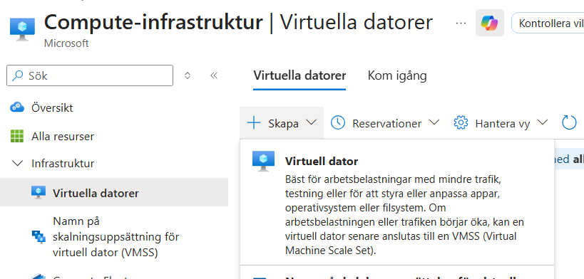

I början av VM skapandet ska vi välja premuration och resursgrupp. Samt ge ett bra beksrivande namn till exempel **vm-novatrix-web** och samma region som vi gjorde våran resursgrupp alltså **Sweden central**
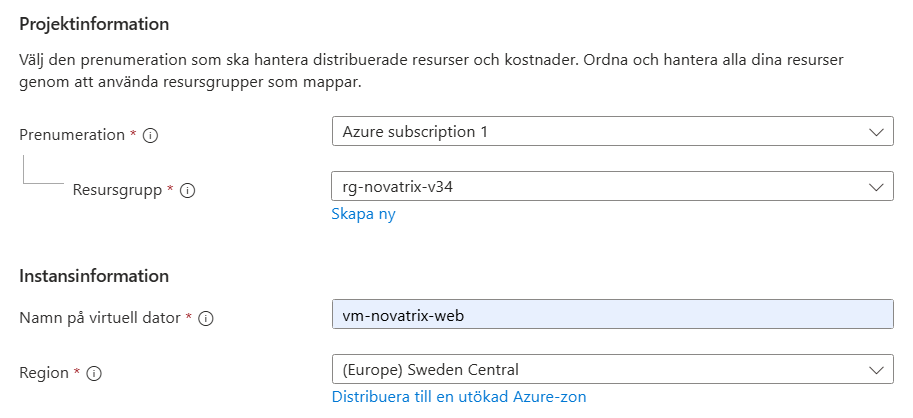

Därefter väljer vi serverns operativsystem eller så kallad image och vi kommer använda oss av **Ubuntu Server** och storleken av Våran virtual machine komemr vara **Standard_B2ats_v2**
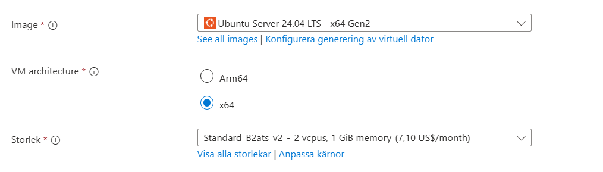

Det sista av ändringarna vi kommer göra i inställningarna är att generera en SSH nyckel vilket görs automatisk med dessa inställningar.
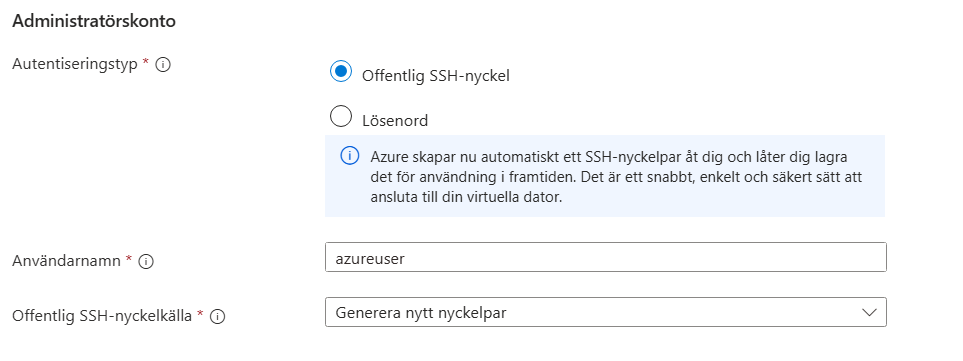

**VIKTIGT LADDA NER SSH NYCKEL DETTA ÄR ENDA CHANCEN DU FÅR ANNARS MÅSTE DU SKAPA EN NY VM**</br>
Efter de ändringarna dubbelkollar så att allting stämmer och så trycker man på klar. Så skapas allting som din VM behöver för att fungera.

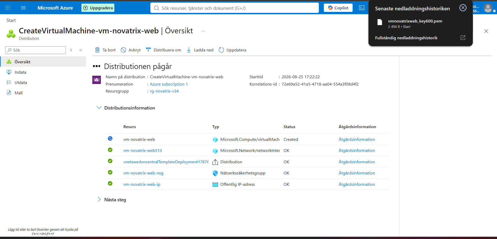

## Steg 3: Anslut till Ubuntu Server VM via SSH

Efter du har laddat ner din nyckel och lagt den på en relevant plats behöver vi sätta access till den för servern.
Detta gör vi genom att öppna powershell och browsa till mappen där SSH nyckeln ligger
i mitt fall ligger den i **C:\AzureMov25** </br>
Därefter kommer vi använda följande 3 kommandon i ordningen som de finns för att kunna sätta behörigheten så du kan ansluta till servern. <br/> Här är mitt exempel :

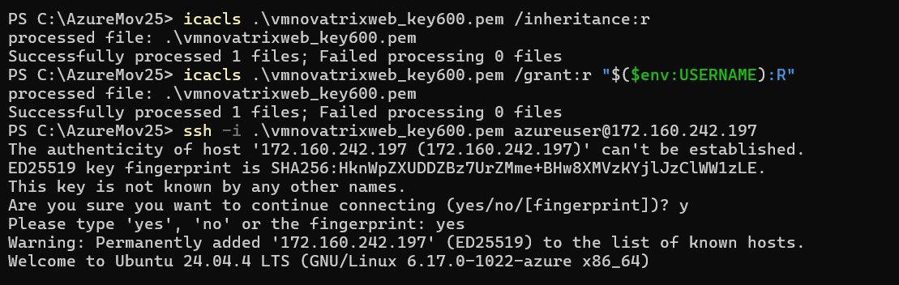
````
icacls.\din-nyckel.pem /inhertiance:r
````
````
icacls .\din-nyckel.pem /grant:r "$($env:USERNAME):R"
````

För att sedanhitta din public ID kan du leta på översiktfliken på din VM i Azure portalen.
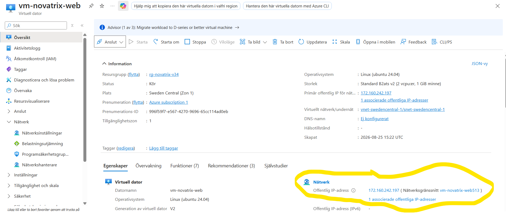
````
ssh -i din-nyckel-pem azureuser@DUN-PUBLIKA-IP
````


Efter detta borde du ha fått anslutning till servern! 
Då rekommenderars en uppdatering av servern med följande kommando. vilket kommer försöka uppdatera allting och nämna i slutet av installeringen om någonting behövs göras.
````
sudo apt update
````
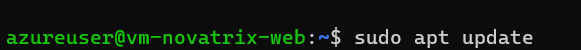
##  Steg 4 : Installera Nginx

Nu har vi access till en nyuppdaterad server och vi ska installera Nginx vilket kommer hosta våran webbsida åt oss. Denna installation gör vi genom följande kommando.

````
sudo apt install nginx -y
````
För att sedan dubbelkolla så installationen fungerade och programmet körs ska vi därefter checka statusen på programmet.
Det borde stå **Active(running)** i grön text i detta stycke kod. </br>
 
````
systemctl status nginx
````
Efter att denna kod har körts så exitar du med **Q** då vi inte ska verifiera någonting mer


Nu ska vi öppna port 80 för http inte https. Detta gör vi genom att navigera till nätverksinställningar på din nyskapade VM. <br/>
Där ska vi lägga till en regel för en inkommande port. 
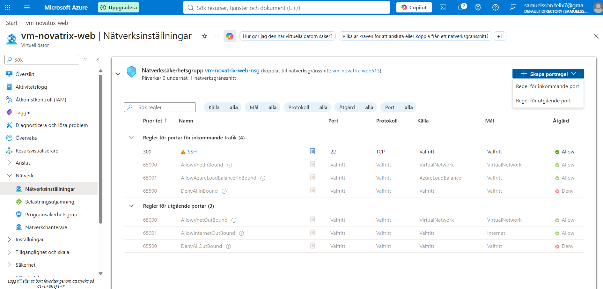
I denna meny är det enda vi ska göra att ändra tjänst till HTTP eller port 80 och sedan sätta ett namn och beskrivning på regeln.

För att verifiera att det funkade ska vi browsa till http://DIN_PUBLIKA_ID som i mitt fall var http://172.160.242.197 <br/>
Där ska vi se en välkomstsida till Nginx som vi ska konfigurera i nästa steg till våra specifikationer.

## Steg 5: Redigera Nginx webbsida

För att konfigurera webbsidan och HTML filen ska vi föst browsa till /var/www/html


Därefter kan vi använda dir för att se vad namnet på filen är och gå in och edita den med **sudo nano NAMNET-PÅ-FILEN**
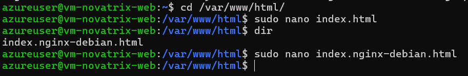

````
sudo nano index.nginx-debian.html
````
innuti denna HTML editor används följande HTML koden för att ha lite input och val för webbsidan


````
<!DOCTYPE html>
<html lang="sv">
<head>
<title>Welcome to nginx!</title>
<style>
html { color-scheme: light dark; }
body { width: 35em; margin: 0 auto;
font-family: Tahoma, Verdana, Arial, sans-serif; }
</style>
</head>
<body>
<h1>Novatrix</h1>
<p>Uppdateras inom kort</p>

<form>
<label for='name'>Namn</label>
<input type='text' id='name' name='name'> <br/>
<label for='mail'>Mail</label>
<input type='text' id='mail' name='mail'><br/>
<label for='msg'>Meddelande</label>
<textarea for='msg' name='msg' rows='4' cols='50' ></textarea><br/>
<input type='submit' value='Skicka'>
</form>

</body>
</html>
````

Därefter kan vi browsa till våran webbsida igen och dubbelkolla om allting fungerar så borde det se ut såhär!

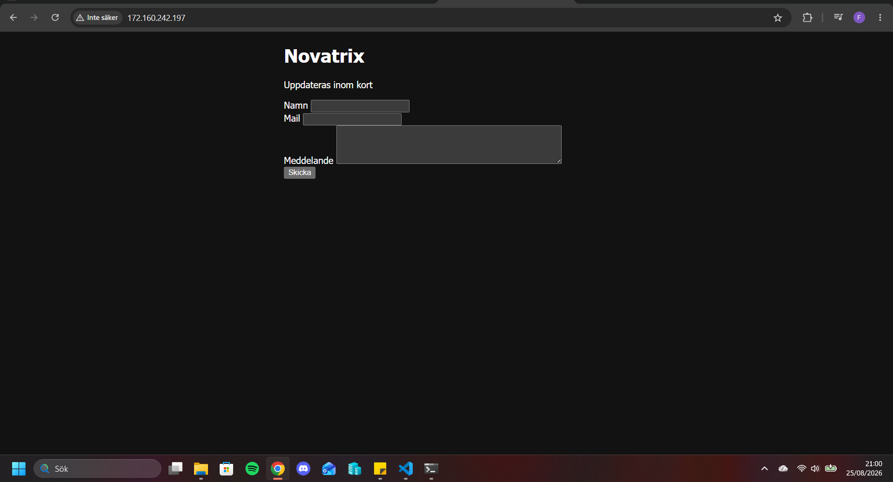


