## V36 - Konfiguration av Virtuella nätverk och internet access  
**Av Felix Samuelsson**  
**Kurs: Microsoft Azure**  
Github Repo: https://github.com/03felsam/azure-mov25

## Mål

I denna uppgift ska vi skapa ett virtuellt nätverk samt sätta upp NSG:er för att reglera trafiken och säkerheten för vår VM.

- Skapa virtuellt nätverk med subnät
- Konfigurera säkerhet och skapa NSG:er
- Implementera nätverksändringar
- Verifiering

## Skapa resurser

Bygg nätverket först och sedan säkerheten.

Sök på **Virtuella nätverk**.

Skapa ett VNet med adressutrymmet `10.0.0.0/16` och ett subnät med storleken `10.0.0.0/24`.

På första sidan när du skapar ett virtuellt nätverk sätter du namn och resursgrupp.

Därefter använder vi de redan inställda säkerhetsinställningarna och går sedan vidare till adressutrymmet.

I adressutrymmet sätter du startadress samt storlek på standardundernätet. Där kommer vi välja `/16` storlek för VNet och `/24` storlek för undernätet, som visas nedanför. Därefter kan du granska och skapa gruppen.

Därefter navigerar vi till **undernät-fliken** i VNet-resursen vi skapade.

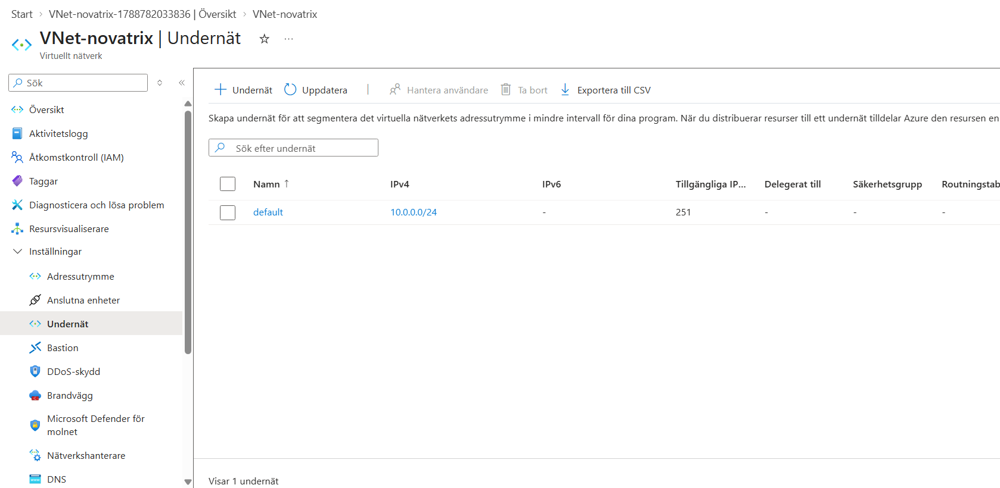

Gå sedan in på resursen du skapade och skapa fler subnät med `/24` och med konsekventa namn. I mitt fall valde jag **Snet-web** och en till `/24` som heter **Snet-db**.

Vi kommer mest använda **Snet-web** och kommer senare sätta en säkerhetsgrupp på den.

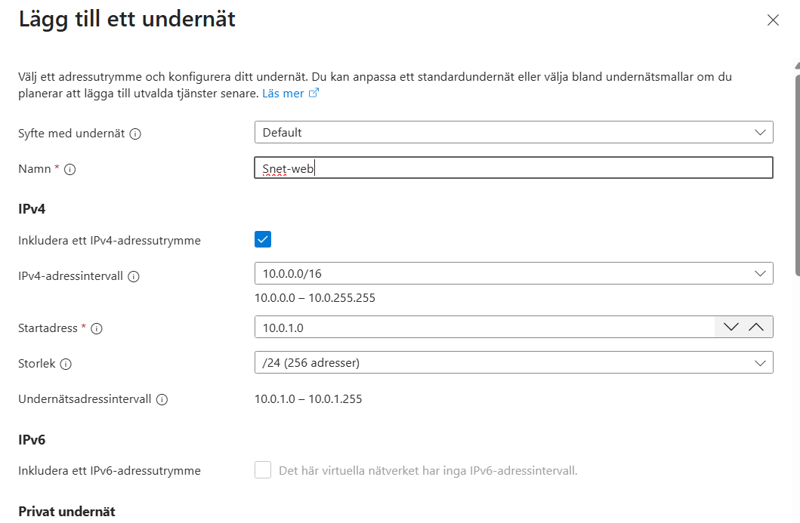

## Network Security Groups

I detta steg gör vi så att nätverket vi har skapat får en säkrare trafik genom NSG:er.

För att skapa en NSG navigerar vi till **Nätverksgrund | Nätverkssäkerhetsgrupper**.

Därefter trycker vi på **skapa**, där vi namnger gruppen och lägger den i vår resursgrupp.

I mitt fall döper jag gruppen till **nsg-web**.

Därefter ska vi skapa **inbound rules** för vår NSG, vilket begränsar vilken trafik som kan nå vår server.

Första regeln som ska skapas kommer att öppna portarna **80 och 443**, vilket öppnar HTTP och HTTPS-access. Detta gör vi genom följande parametrar.

Källa : Service Tag  
Källtjänsttagg : Internet  
Källportsintervall : *  
Destination : Any  
Tjänst : Custom  
Målportsintervall : 80,443  
Protokoll : TCP  
Åtgärd : Allow  

Slutligen lägger vi till en beskrivning och ett namn på säkerhetsregeln för enklare administrering.

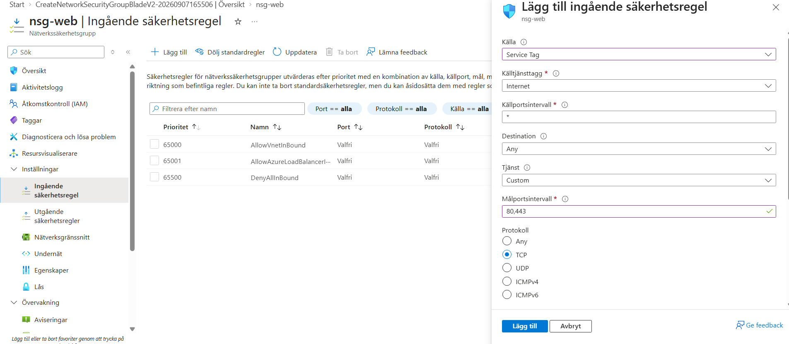

Därefter ska vi skapa en regel för att begränsa SSH-access. Det gör vi genom att begränsa så att alla SSH-anslutningar bara får hända från min IP-adress. Annars blir de automatiskt denied.

Det görs genom följande:

Källa : My IP address  
Källtjänsttagg : *  
Destination : Any  
Tjänst : SSH  
Åtgärd : Allow  
Prioritet : 200

Därefter ska vi koppla vår NSG till vårt skapade subnät genom att gå till **undernät-fliken** på vår NSG.

Där ska vi välja **assosiera** och välja det VNet och subnät som vi skapade tidigare. I mitt fall var det **Vnet-novatrix** och **Snet-web**.

## Network Interface Card

Slutligen ska vi skapa ett nytt **Network Interface Card (NIC)**.

Detta NIC ska placeras på en VM som vi vill att reglerna vi satte upp i förra steget ska gälla för.

Mitt exempel för att skapa ett NIC är nedanför.

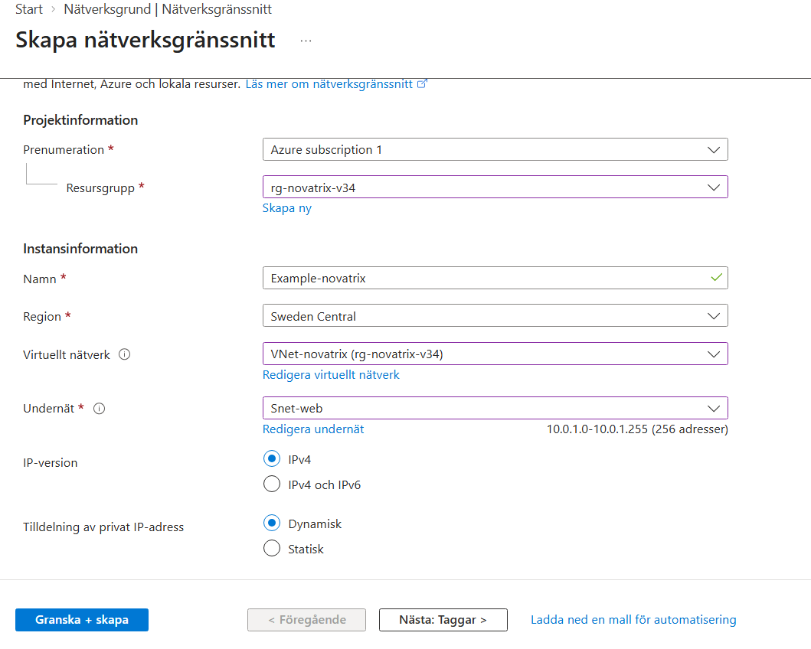

Slutligen ska detta anslutas till en VM under skapandet av den virtuella maskinen.

## Verifiering

Efter att du har konfigurerat upp allting, inklusive en VM från tidigare guide, kan vi använda **Network Watcher** för att verifiera IP-adresser och testa om våra regler är aktiva och fungerar.

Första målet är att webbtrafik på port **80/443** ska släppas igenom.

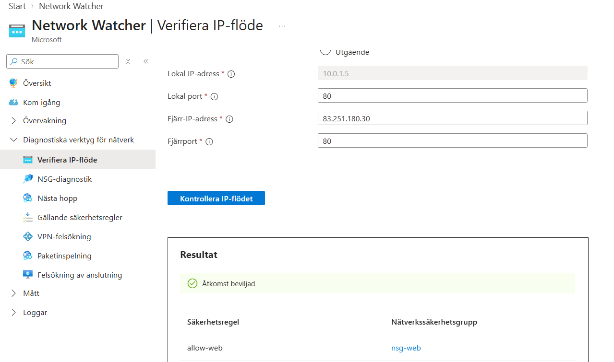

Därefter ska **SSH, port 22, från min IP-adress** gå igenom.

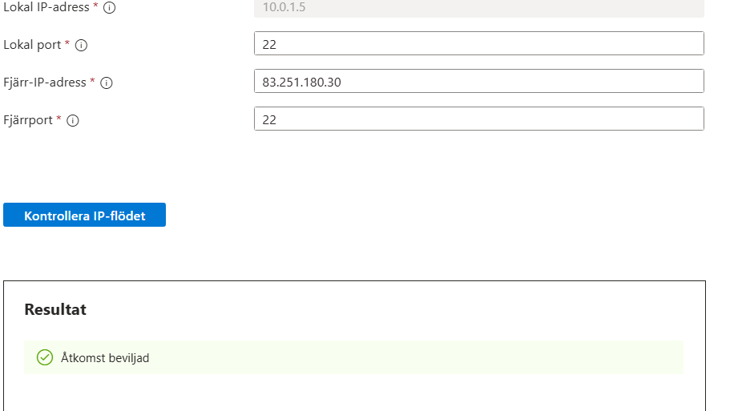

Medan SSH på port 22 från en annan IP-adress blir **denied**.

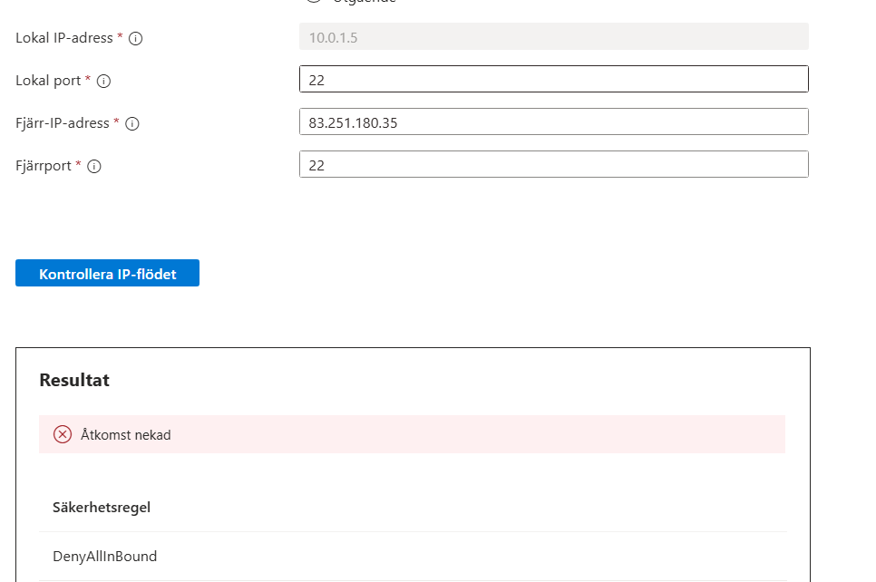

Och slutligen blir all annan trafik **denied**.

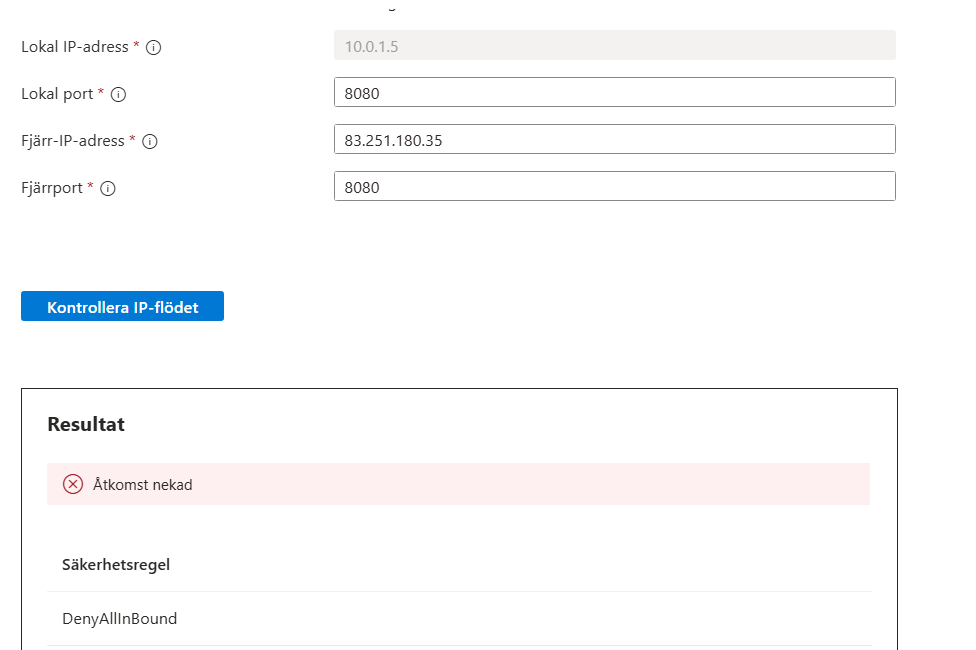

Vi kan också verifiera att alla regler och subnät är kopplade genom **nätverksinställningar**-fliken. Där kan vi se om våra skapade regler finns där samt om den privata IP-adressen ligger inom våra satta scopes.

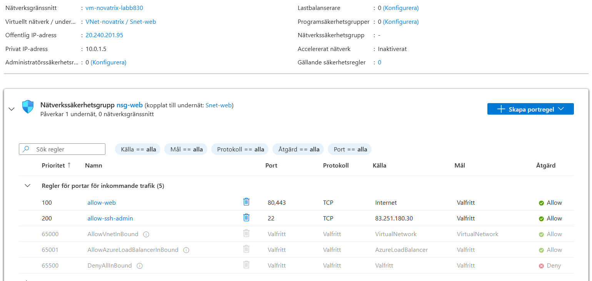

Verifiering att vårt VNet skapades i rätt resursgrupp kan ses under **resurser**.

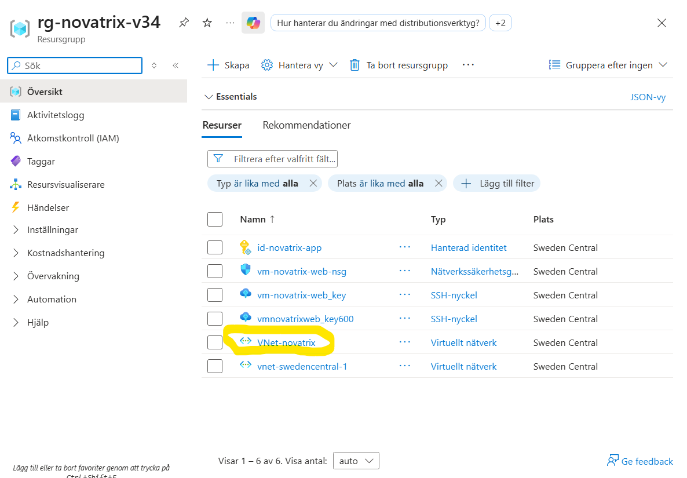

Slutligen har vi ett diagram av nätverket vi precis har satt upp!
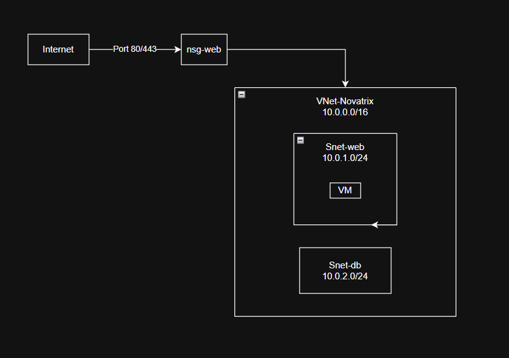

