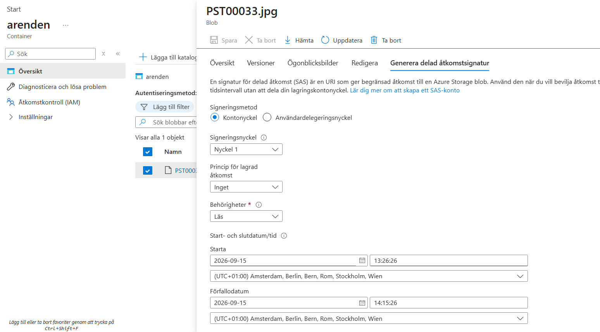
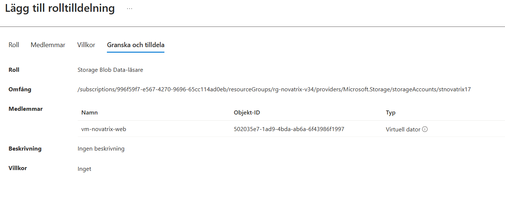
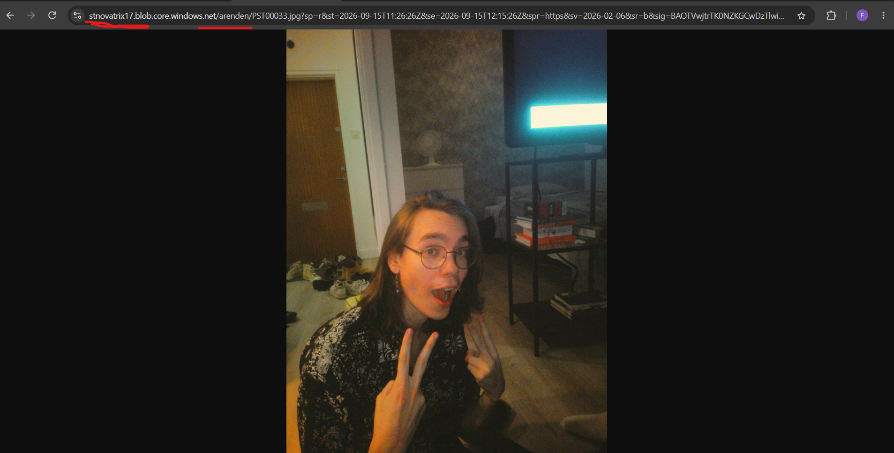
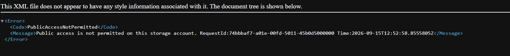
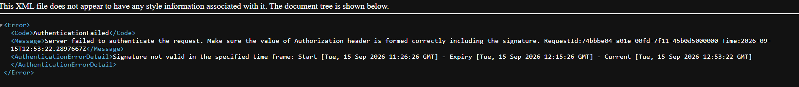

## V37 - Konfiguration av Storage <br/>
**Av Felix Samuelsson** </br>
**Kurs: Microsoft Azure** </br>
Github Repo: https://github.com/03felsam/azure-mov25

## Mål


## Steg 1 
Navigera till Lagringskonto | blob storage / storage account där du kan skapa ett blob konto 

I detta blobbkonto ska du skapa ett konto med ett Unikt namn i **hela** azure men bara små bokstäver och siffror är tillåtna med mellan 3 och 24 tecken

Skapa sedan kontot i rätt region samt resursgrupp och denna primära tjänsten vi ska använda är azure blob storage samt standard prestanda och vi ska ha LRS som inställning.


detta är det enda vi ska ändra nu så gå därefter och skapa gruppen

Detta är våran lagringsplats vi kommer att använda

Navigera sedan till containrar och skapa en privat!
 jag kommer döpa min till arenden 

 

Gå sedan in på containren som vi skapade och ladda upp ett exempel på fil

då kan vi gå in på den nyuppladdade filen och hitta en URL som vi kan kopiera.

verifiering av detta görs genom resursgruppen och att se om den ligger där samt gå in på containern och se på overwiew om det är rätt region resursgrupp och LRS
 

 ## access
 genom att navigera till containern aenden vi skapade kan vi sedan gå iin på den delade bilden i detta fall och sedan trcyka på generera SAS eller generera delad åtkomsttruktur

 där vi kan fylla i vilka tider samt rättiheter för länken 

 

 där du senare kan kopiera blob URL med SAS token 


 Sätt upp RBAC

 Gå tillbaka till stnovatrix17 eller med andra ord vårat blob konto där du kan navigerara till IAM eller åtkomstkontroll fliken. Där du sedan kan gå in på rolltilldelnignar och trycka på plus för att lägga till en rolltilldelnign.

 Därefter ska vi lägga till rollen Storage Blob Data-läsare
därefter ska vi assigna denna roll till våran VM vilket är en hanterad identitet vilket betyder om du inte kan adda din VM sätt på systemtilldelad identitiet på VM:en
 
 slutligen dubbelkolla så allting stämmer och spara.
 

därefter kan vi verifiera genom dessa bilder






Slutlig lösning genom att bash inte fungerade 

## Så fick vi Flask att fungera

Kontrollerade Flask-installationen

````
python3 -m pip show flask
````
Flask var installerat, men bara för användaren azureuser.

Identifierade problemet

Flask-applikationen kördes via systemd som användaren www-data. Därför kunde tjänsten inte hitta Flask som låg installerat i:

**/home/azureuser/.local/lib/python3.12/site-packages**

Installerade Flask och Azure-paketen för systemets Python
Vi installerade:
Flask </br>
azure-identity </br>
azure-storage-blob

Verifierade installationen
Vi kontrollerade att www-data kunde importera Flask:

````
sudo -u www-data /usr/bin/python3 -c "import flask; print(flask.__version__)"
````

Startade om Flask-tjänsten

sudo systemctl restart arendeapp

Kontrollerade loggarna
Med:
````
journalctl -u arendeapp
````
kunde vi se att Flask nu startade korrekt.

Resultat: Flask-backendens 502-fel försvann och webbservern kunde kommunicera med Flask. Det efterföljande felet visade sig vara ett separat behörighetsproblem mot Azure Blob Storage, vilket löstes genom att ge VM:ens Managed Identity rollen Storage Blob Data Contributor.
````

#cloud-config
# V37 Utokad: web VM that serves the Novatrix ticket form AND writes each
# ticket to Blob Storage via the VM's system-assigned managed identity.
# Pure ASCII on purpose, so az --custom-data does not mangle it.
package_update: true

packages:
  - nginx
  - python3
  - python3-pip

write_files:
  - path: /opt/arendeapp/app.py
    owner: root:root
    permissions: '0644'
    content: |
      # -*- coding: ascii -*-
      # Novatrix arende backend (V37 Utokad).
      # Receives a support ticket from the web form and stores it in Blob Storage
      # using the web VM's system-assigned managed identity. No account key is used.
      #
      # Students change STORAGE_ACCOUNT below to their own globally unique account
      # name (the same account the provisioning script created). Nothing else needs
      # to change for the base to work.

      import json
      import uuid
      from datetime import datetime, timezone

      from flask import Flask, request, Response
      from azure.identity import DefaultAzureCredential
      from azure.storage.blob import BlobServiceClient, ContentSettings

      # --- Settings students may change -------------------------------------------
      # Your globally unique storage account name (no https, no .blob..., just name).
      STORAGE_ACCOUNT = "stnovatrix17"
      # Container that receives the tickets (created by the provisioning script).
      CONTAINER = "arenden"
      # ----------------------------------------------------------------------------

      ACCOUNT_URL = "https://{0}.blob.core.windows.net".format(STORAGE_ACCOUNT)

      app = Flask(__name__)

      # One credential and one client for the whole app.
      # DefaultAzureCredential automatically picks up the VM's system-assigned
      # managed identity through IMDS, so there is no secret anywhere in the code.
      _credential = DefaultAzureCredential()
      _blob_service = BlobServiceClient(account_url=ACCOUNT_URL, credential=_credential)


      def _container():
          return _blob_service.get_container_client(CONTAINER)


      @app.post("/submit")
      def submit():
          # Read the fields from the form. The names here must match index.html.
          name = request.form.get("name", "").strip()
          mail = request.form.get("mail", "").strip()
          msg = request.form.get("msg", "").strip()
          image = request.files.get("bild")

          # A unique id per ticket: UTC timestamp plus a short random suffix.
          stamp = datetime.now(timezone.utc).strftime("%Y%m%dT%H%M%SZ")
          ticket_id = "{0}-{1}".format(stamp, uuid.uuid4().hex[:8])

          ticket = {
              "id": ticket_id,
              "name": name,
              "mail": mail,
              "message": msg,
              "created": stamp,
          }

          container = _container()

          # 1) Store the ticket itself as a JSON blob under its own folder.
          container.upload_blob(
              name="{0}/arende.json".format(ticket_id),
              data=json.dumps(ticket, ensure_ascii=False).encode("utf-8"),
              overwrite=True,
              content_settings=ContentSettings(content_type="application/json"),
          )

          # 2) Store the attached image next to it, if the user sent one.
          if image is not None and image.filename:
              container.upload_blob(
                  name="{0}/{1}".format(ticket_id, image.filename),
                  data=image.stream,
                  overwrite=True,
              )

          # A plain confirmation page. ASCII only, so the file survives cloud-init.
          body = (
              "<!DOCTYPE html><html lang='sv'><head><meta charset='UTF-8'>"
              "<title>Tack</title></head>"
              "<body style='font-family:Arial;max-width:640px;margin:40px auto'>"
              "<h1>Tack!</h1>"
              "<p>Ditt arende ar sparat med id <code>{0}</code>.</p>"
              "<p><a href='/'>Skicka in ett till</a></p>"
              "</body></html>"
          ).format(ticket_id)
          return Response(body, mimetype="text/html")


      @app.get("/health")
      def health():
          # Handy for a quick check that the backend is up and reading its config.
          return {"status": "ok", "account": STORAGE_ACCOUNT, "container": CONTAINER}


      if __name__ == "__main__":
          # Bind to localhost only. nginx sits in front and proxies /submit to here.
          app.run(host="127.0.0.1", port=5000)


  - path: /var/www/html/index.html
    owner: root:root
    permissions: '0644'
    content: |
      <!DOCTYPE html>
      <html lang="sv">
      <head>
        <meta charset="UTF-8">
        <meta name="viewport" content="width=device-width, initial-scale=1.0">
        <title>Novatrix kundtj&auml;nst</title>
        <style>
          body { font-family: Arial, sans-serif; max-width: 640px; margin: 40px auto; padding: 0 16px; color: #1f2d3d; }
          h1 { color: #2f5496; }
          p { color: #4a5568; }
          form { display: grid; gap: 12px; margin-top: 24px; }
          label { font-weight: bold; }
          input, textarea { width: 100%; padding: 8px; box-sizing: border-box; }
          button { width: 180px; padding: 10px; background: #2f5496; color: #fff; border: none; cursor: pointer; }
        </style>
      </head>
      <body>
        <h1>Novatrix kundtj&auml;nst</h1>
        <p>Skicka in ett &auml;rende s&aring; &aring;terkommer vi s&aring; snart vi kan.</p>
        <!-- action points at the backend, method post, enctype so the file follows along -->
        <form action="/submit" method="post" enctype="multipart/form-data">
          <label for="name">Namn</label>
          <input type="text" id="name" name="name">

          <label for="mail">E-post</label>
          <input type="email" id="mail" name="mail">

          <label for="msg">Meddelande</label>
          <textarea id="msg" name="msg" rows="5"></textarea>

          <label for="bild">Bifoga en bild</label>
          <input type="file" id="bild" name="bild">

          <button type="submit">Skicka &auml;rende</button>
        </form>
      </body>
      </html>


  - path: /etc/nginx/sites-available/default
    owner: root:root
    permissions: '0644'
    content: |
      # nginx site for the Novatrix ticket form (V37 Utokad).
      # nginx serves the static page and reverse-proxies /submit to the Flask backend.
      server {
          listen 80 default_server;
          listen [::]:80 default_server;

          root /var/www/html;
          index index.html;

          # Allow a reasonably sized image upload (the browser posts the file here).
          client_max_body_size 10m;

          location / {
              try_files $uri $uri/ =404;
          }

          # The form posts here; hand it to the backend that owns the managed identity.
          location = /submit {
              proxy_pass http://127.0.0.1:5000/submit;
              proxy_set_header Host $host;
              proxy_set_header X-Real-IP $remote_addr;
          }
      }


  - path: /etc/systemd/system/arendeapp.service
    owner: root:root
    permissions: '0644'
    content: |
      # systemd unit for the Flask backend (V37 Utokad).
      # Keeps the ticket backend running and restarts it if it stops.
      [Unit]
      Description=Novatrix arende backend (Flask)
      After=network-online.target
      Wants=network-online.target

      [Service]
      WorkingDirectory=/opt/arendeapp
      ExecStart=/usr/bin/python3 /opt/arendeapp/app.py
      Restart=on-failure
      User=www-data

      [Install]
      WantedBy=multi-user.target


runcmd:
  # Install the Azure SDK bits the backend needs (system-wide).
  - pip3 install flask azure-identity azure-storage-blob || pip3 install --break-system-packages flask azure-identity azure-storage-blob
  # Start the ticket backend and make sure it comes back on reboot.
  - systemctl daemon-reload
  - systemctl enable --now arendeapp
  # (Re)load nginx so it serves the page and proxies /submit to the backend.
  - systemctl enable --now nginx
  - systemctl restart nginx


´´´´


  