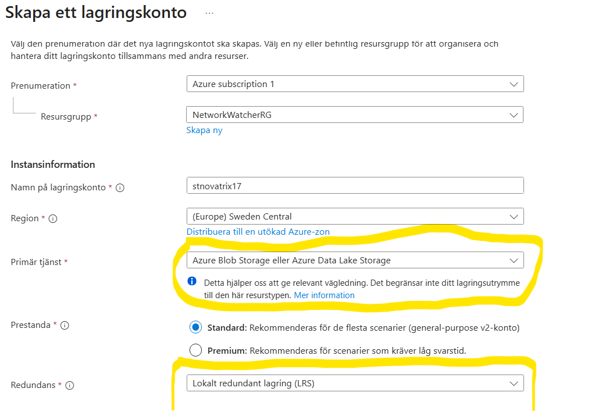
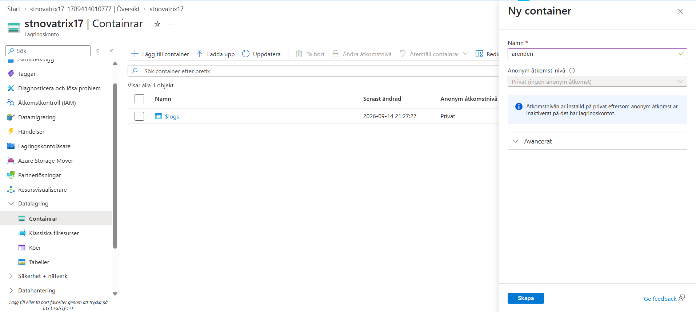

## V37 - Konfiguration av Storage  
**Av Felix Samuelsson**  
**Kurs: Microsoft Azure**  
Github Repo: https://github.com/03felsam/azure-mov25

## Mål

## Steg 1 
Navigera till Lagringskonto | blob storage / storage account där du kan skapa ett blob konto 

I detta blobbkonto ska du skapa ett konto med ett Unikt namn i **hela** azure men bara små bokstäver och siffror är tillåtna med mellan 3 och 24 tecken

Skapa sedan kontot i rätt region samt resursgrupp och denna primära tjänsten vi ska använda är azure blob storage samt standard prestanda och vi ska ha LRS som inställning.

detta är det enda vi ska ändra nu så gå därefter och skapa gruppen

Detta är våran lagringsplats vi kommer att använda

Navigera sedan till containrar och skapa en privat!
 jag kommer döpa min till arenden 

 

Gå sedan in på containren som vi skapade och ladda upp ett exempel på fil

då kan vi gå in på den nyuppladdade filen och hitta en URL som vi kan kopiera.

verifiering av detta görs genom resursgruppen och att se om den ligger där samt gå in på containern och se på overwiew om det är rätt region resursgrupp och LRS
 