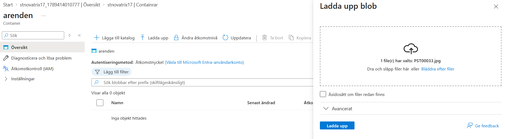
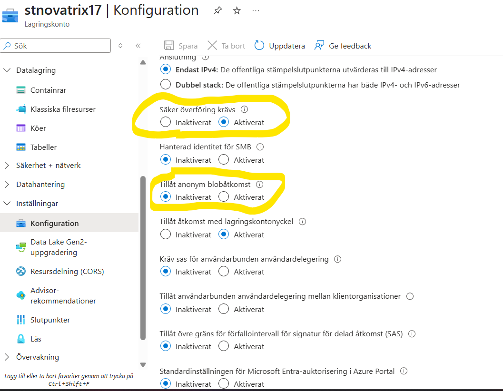
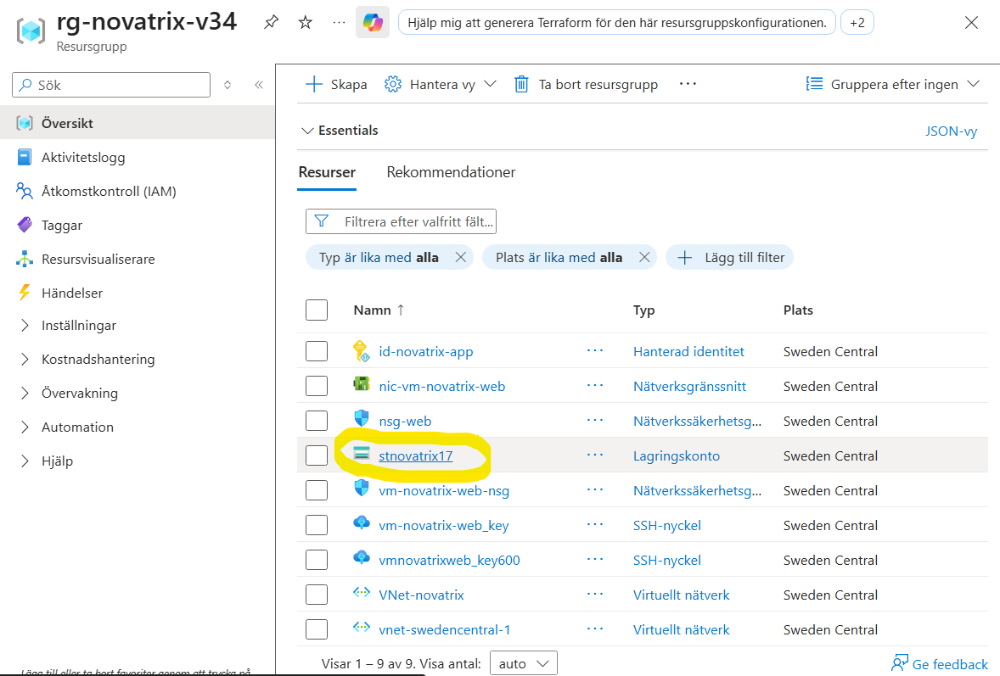
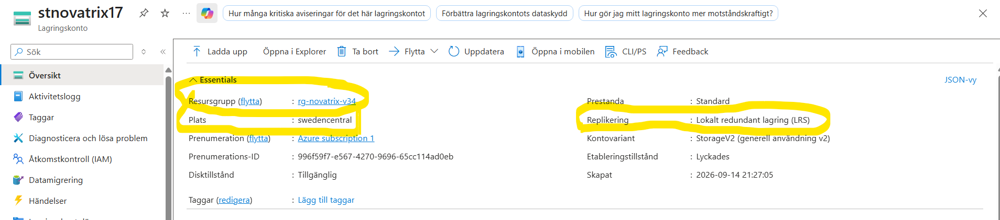
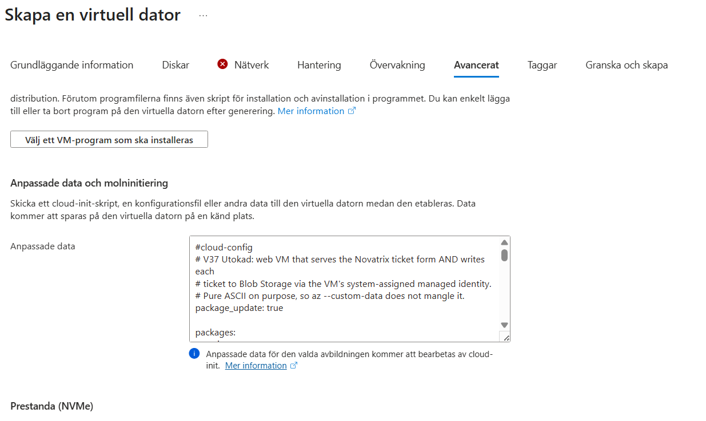
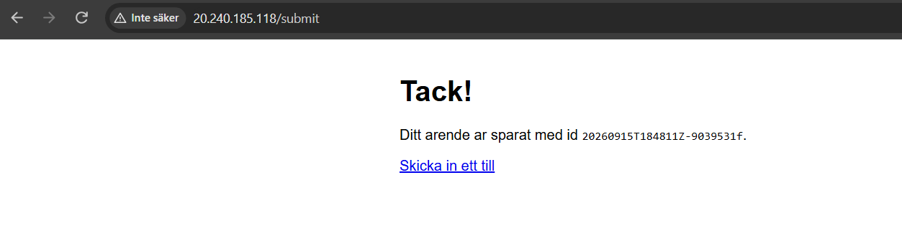
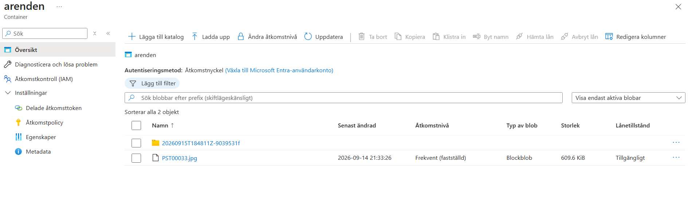

# V37 – Konfiguration av Storage

**Av Felix Samuelsson**

**Kurs: Microsoft Azure**

GitHub Repo: [https://github.com/03felsam/azure-mov25](https://github.com/03felsam/azure-mov25)

## Mål

- Skapa ett lagringskonto
- Säkra åtkomst
- Koppla formuläret till lagring
- Verifiera resultatet under processen

## Steg 1 – Skapa ett Storage Account

Första steget i denna guide är att skapa ett lagringskonto som vi sedan kommer att bygga vidare på.

För att göra detta navigerar vi till **Storage accounts / Lagringskonton** i Azure, där vi kan skapa ett nytt lagringskonto.

I detta steg ska vi skapa ett konto med ett **unikt namn i hela Azure**. Namnet får endast innehålla små bokstäver och siffror och måste vara mellan 3 och 24 tecken långt.

I mitt fall använde jag namnet `stnovatrix17`. Ett unikt namn minskar risken för att namnet redan används av någon annan.

Skapa sedan lagringskontot i samma region som den resursgrupp som skapades tidigare. I mitt fall är regionen **Sweden Central**.

Följande inställningar används:

- **Resource group:** `rg-novatrix-v34`
- **Region:** Sweden Central
- **Primary service:** Azure Blob Storage
- **Performance:** Standard
- **Redundancy:** LRS (Locally-redundant storage)


Dessa är de huvudsakliga inställningarna vi behöver ändra i detta steg. När allt är checkat kan lagringskontot skapas.

Ett Storage Account fungerar som en central lagringsplats där vi bland annat kan lagra filer som Blob Storage-objekt på en central plats som är åtkommer genom webben.

Efter att lagringskontot har skapats navigerar vi till **Containers** och skapar en ny container. Containern ska vara **privat**, så att objekten inte är publikt åtkomliga.

Jag döper min container till `arenden`, eftersom den kommer att användas för att lagra de supportärenden som skickas in via webbformuläret.


Gå sedan in i containern som skapades och ladda upp en exempel-fil. Jag använde min Instagram-profilbild som testfil.



När filen har laddats upp kan vi öppna den och se Blob-URL:en till objektet. Denna URL kan användas för att adressera filen, men eftersom containern är privat går det inte att komma åt filen utan korrekt behörighet.

Vi kommer senare att konfigurera olika säkerhetsmekanismer för att kontrollera vem som får åtkomst till filerna.

Slutligen ska vi konfigurera lagringskontot genom att kontrollera att **Secure transfer required / Säker överföring krävs** är aktiverat och att **anonym blobåtkomst** inte är tillåten.



För att verifiera att allt är korrekt konfigurerat kontrollerar vi bland annat:

- Rätt region
- Rätt resursgrupp
- Rätt prestandanivå
- Rätt replikeringsalternativ, i detta fall LRS





## Access – Åtkomst och säkerhet

För att begränsa åtkomsten till våra Blob-objekt ska vi först testa **SAS (Shared Access Signature)**. Eftersom anonym access inte är påsatt kommer detta vara det huvudsakliga sättet att se våra filer vi har laddat upp.

Navigera till containern `arenden` som vi skapade tidigare och öppna den uppladdade testbilden.

Där kan vi välja alternativet för att **generera SAS**.

En SAS-token används för att skapa en tidsbegränsad åtkomst till ett specifikt objekt. När SAS-länken skapas kan vi bland annat ange:

- När länken börjar gälla
- När länken slutar gälla
- Vilka rättigheter länken ska ha


När parametrarna är valda klickar vi på **Create / Skapa**. Azure genererar då en unik länk som fungerar under den angivna tidsperioden och med de rättigheter som valts.

Här är ett exempel på en fungerande SAS-länk med en tidsbegränsning:


Om vi istället försöker använda den vanliga Blob-URL:en utan SAS-token nekas åtkomsten eftersom containern är privat.


När SAS-länkens giltighetstid har passerat kan länken inte längre användas för att komma åt objektet.


## RBAC – Role-Based Access Control

Nästa steg är att konfigurera **RBAC (Role-Based Access Control)** för att bestämma vilka identiteter som får hantera våra ärenden i Blob Storage.

Detta görs genom att gå tillbaka till Storage Account `stnovatrix17` och navigera till **IAM / Access control (Åtkomstkontroll)**.

Välj sedan **Role assignments / Rolltilldelningar** och klicka på **Add / Lägg till** för att skapa en ny rolltilldelning.

Vi ska lägga till rollen:

**Storage Blob Data Contributor**

Denna roll ger identiteten behörighet att läsa, skriva och ändra Blob-data.

Därefter tilldelar vi rollen till vår VM genom att välja en **Managed Identity** och ange vilken VM som ska använda rollen.

Om VM:en inte går att välja behöver vi kontrollera att **System-assigned managed identity** är aktiverad på VM:en.

När rätt identitet och roll har valts kontrollerar vi inställningarna och sparar rolltilldelningen.

> **Observera:** Bilden nedan visar ett exempel från konfigurationen, men rollen på bilden är inte korrekt för detta steg. Den korrekta rollen ska vara **Storage Blob Data Contributor**.


## Skapa VM med Cloud-Init

Slutligen ska vi skapa den VM som ska användas för webbapplikationen.

Under skapandet av VM:en kan vi lägga till vår `cloud-init.txt` under:

**Advanced → Custom data and cloud-init**

På följande sätt:



Cloud-init-filen används för att automatiskt konfigurera VM:en vid skapandet.

Den installerar bland annat Nginx, Python och de Python-paket som behövs för Flask-applikationen. Den skapar även webbplatsen, Flask-backenden och Nginx-konfigurationen som krävs för kommunikationen mellan webbformuläret och Blob Storage.

På så sätt kan webbformuläret som vi byggt tidigare kommunicera med Flask-backenden och därefter lagra inskickade ärenden i Azure Blob Storage.

### Flash tjänsten fungerade alldrig

Dock gick inte denna Cloud-init-konfiguration hela vägen, eftersom Flask-applikationen startade inte korrekt på grund av att Flask inte var tillgängligt för den användare som körde systemd-tjänsten. Därför har jag laggt till denna extrabit på hur problemet löstes genom hjälp av AI och google. 
Detta problemet uppstår nog inte om din VM skapas genom kod i azure, men jag kunde inte få det att fungera då jag inte hade gjort någon av VG delarna, därför blev det en väldigt konstig lösning som jag inte helt förstår mig på kodvis utan bara teoretiskt. 

##

Först kontrollerade vi om Flask var installerat genom:
````
journalctl -u arendeapp
````
men även
````
python3 -m pip show flask
````
Flask var installerat, men bara för användaren azureuser.


Flask-applikationen kördes via systemd som användaren www-data. Därför kunde tjänsten inte hitta Flask som låg installerat i:

**/home/azureuser/.local/lib/python3.12/site-packages**

Därefter installerades Flask på rätt ställe:
````
sudo /usr/bin/python3 -m pip install --break-system-packages --ignore-installed blinker flask azure-identity azure-storage-blob
````

Efteråt kontrollerade vi att www-data kunde importera Flask:

````
sudo -u www-data /usr/bin/python3 -c "import flask; print(flask.__version__)"
````

Startade om Flask-tjänsten

````
sudo systemctl restart arendeapp
````
Kontrollerade loggarna
Med:
````
journalctl -u arendeapp
````
Därför kunde vi se att Flask nu startade korrekt.

 Jag försökte mitt bästa med att få med alla kod jag använde som fungerade men jag skapade om och tog ner min VM ett flertal gånger över ett flertal dagar och skulle ha dokumenterat bättre och kan inte garantera att det blev 100% rätt.

Resultat: Flask-backendens 502-fel försvann och webbservern kunde kommunicera med Flask. Jag fick ett efterföljande fel som visade sig vara ett separat behörighetsproblem mot Azure Blob Storage, vilket löstes genom att ge VM:ens Managed Identity rollen Storage Blob Data Contributor.

Slutligen fungerade hela systemet.




 
 

 ##
 Nedanför har vi cloud-init.txt filen vilket användes för deployment här: 


>VIKTIGT 
FÖR ATT DETTA SKA APPLICERAS I EN ANNAN MILJÖ ÄNDRA FÖLJANDE: </br>
STORAGE_ACCOUNT = "stnovatrix17"</br>
OCH</br>
CONTAINER = "arenden"</br>
Till dina lokala namn på ditt storage konto och container.
````

#cloud-config
# V37 Utokad: web VM that serves the Novatrix ticket form AND writes each
# ticket to Blob Storage via the VM's system-assigned managed identity.
# Pure ASCII on purpose, so az --custom-data does not mangle it.
package_update: true

packages:
  - nginx
  - python3
  - python3-pip

write_files:
  - path: /opt/arendeapp/app.py
    owner: root:root
    permissions: '0644'
    content: |
      # -*- coding: ascii -*-
      # Novatrix arende backend (V37 Utokad).
      # Receives a support ticket from the web form and stores it in Blob Storage
      # using the web VM's system-assigned managed identity. No account key is used.
      #
      # Students change STORAGE_ACCOUNT below to their own globally unique account
      # name (the same account the provisioning script created). Nothing else needs
      # to change for the base to work.

      import json
      import uuid
      from datetime import datetime, timezone

      from flask import Flask, request, Response
      from azure.identity import DefaultAzureCredential
      from azure.storage.blob import BlobServiceClient, ContentSettings

      # --- Settings students may change -------------------------------------------
      # Your globally unique storage account name (no https, no .blob..., just name).
      STORAGE_ACCOUNT = "stnovatrix17"
      # Container that receives the tickets (created by the provisioning script).
      CONTAINER = "arenden"
      # ----------------------------------------------------------------------------

      ACCOUNT_URL = "https://{0}.blob.core.windows.net".format(STORAGE_ACCOUNT)

      app = Flask(__name__)

      # One credential and one client for the whole app.
      # DefaultAzureCredential automatically picks up the VM's system-assigned
      # managed identity through IMDS, so there is no secret anywhere in the code.
      _credential = DefaultAzureCredential()
      _blob_service = BlobServiceClient(account_url=ACCOUNT_URL, credential=_credential)


      def _container():
          return _blob_service.get_container_client(CONTAINER)


      @app.post("/submit")
      def submit():
          # Read the fields from the form. The names here must match index.html.
          name = request.form.get("name", "").strip()
          mail = request.form.get("mail", "").strip()
          msg = request.form.get("msg", "").strip()
          image = request.files.get("bild")

          # A unique id per ticket: UTC timestamp plus a short random suffix.
          stamp = datetime.now(timezone.utc).strftime("%Y%m%dT%H%M%SZ")
          ticket_id = "{0}-{1}".format(stamp, uuid.uuid4().hex[:8])

          ticket = {
              "id": ticket_id,
              "name": name,
              "mail": mail,
              "message": msg,
              "created": stamp,
          }

          container = _container()

          # 1) Store the ticket itself as a JSON blob under its own folder.
          container.upload_blob(
              name="{0}/arende.json".format(ticket_id),
              data=json.dumps(ticket, ensure_ascii=False).encode("utf-8"),
              overwrite=True,
              content_settings=ContentSettings(content_type="application/json"),
          )

          # 2) Store the attached image next to it, if the user sent one.
          if image is not None and image.filename:
              container.upload_blob(
                  name="{0}/{1}".format(ticket_id, image.filename),
                  data=image.stream,
                  overwrite=True,
              )

          # A plain confirmation page. ASCII only, so the file survives cloud-init.
          body = (
              "<!DOCTYPE html><html lang='sv'><head><meta charset='UTF-8'>"
              "<title>Tack</title></head>"
              "<body style='font-family:Arial;max-width:640px;margin:40px auto'>"
              "<h1>Tack!</h1>"
              "<p>Ditt arende ar sparat med id <code>{0}</code>.</p>"
              "<p><a href='/'>Skicka in ett till</a></p>"
              "</body></html>"
          ).format(ticket_id)
          return Response(body, mimetype="text/html")


      @app.get("/health")
      def health():
          # Handy for a quick check that the backend is up and reading its config.
          return {"status": "ok", "account": STORAGE_ACCOUNT, "container": CONTAINER}


      if __name__ == "__main__":
          # Bind to localhost only. nginx sits in front and proxies /submit to here.
          app.run(host="127.0.0.1", port=5000)


  - path: /var/www/html/index.html
    owner: root:root
    permissions: '0644'
    content: |
      <!DOCTYPE html>
      <html lang="sv">
      <head>
        <meta charset="UTF-8">
        <meta name="viewport" content="width=device-width, initial-scale=1.0">
        <title>Novatrix kundtj&auml;nst</title>
        <style>
          body { font-family: Arial, sans-serif; max-width: 640px; margin: 40px auto; padding: 0 16px; color: #1f2d3d; }
          h1 { color: #2f5496; }
          p { color: #4a5568; }
          form { display: grid; gap: 12px; margin-top: 24px; }
          label { font-weight: bold; }
          input, textarea { width: 100%; padding: 8px; box-sizing: border-box; }
          button { width: 180px; padding: 10px; background: #2f5496; color: #fff; border: none; cursor: pointer; }
        </style>
      </head>
      <body>
        <h1>Novatrix kundtj&auml;nst</h1>
        <p>Skicka in ett &auml;rende s&aring; &aring;terkommer vi s&aring; snart vi kan.</p>
        <!-- action points at the backend, method post, enctype so the file follows along -->
        <form action="/submit" method="post" enctype="multipart/form-data">
          <label for="name">Namn</label>
          <input type="text" id="name" name="name">

          <label for="mail">E-post</label>
          <input type="email" id="mail" name="mail">

          <label for="msg">Meddelande</label>
          <textarea id="msg" name="msg" rows="5"></textarea>

          <label for="bild">Bifoga en bild</label>
          <input type="file" id="bild" name="bild">

          <button type="submit">Skicka &auml;rende</button>
        </form>
      </body>
      </html>


  - path: /etc/nginx/sites-available/default
    owner: root:root
    permissions: '0644'
    content: |
      # nginx site for the Novatrix ticket form (V37 Utokad).
      # nginx serves the static page and reverse-proxies /submit to the Flask backend.
      server {
          listen 80 default_server;
          listen [::]:80 default_server;

          root /var/www/html;
          index index.html;

          # Allow a reasonably sized image upload (the browser posts the file here).
          client_max_body_size 10m;

          location / {
              try_files $uri $uri/ =404;
          }

          # The form posts here; hand it to the backend that owns the managed identity.
          location = /submit {
              proxy_pass http://127.0.0.1:5000/submit;
              proxy_set_header Host $host;
              proxy_set_header X-Real-IP $remote_addr;
          }
      }


  - path: /etc/systemd/system/arendeapp.service
    owner: root:root
    permissions: '0644'
    content: |
      # systemd unit for the Flask backend (V37 Utokad).
      # Keeps the ticket backend running and restarts it if it stops.
      [Unit]
      Description=Novatrix arende backend (Flask)
      After=network-online.target
      Wants=network-online.target

      [Service]
      WorkingDirectory=/opt/arendeapp
      ExecStart=/usr/bin/python3 /opt/arendeapp/app.py
      Restart=on-failure
      User=www-data

      [Install]
      WantedBy=multi-user.target


runcmd:
  # Install the Azure SDK bits the backend needs (system-wide).
  - pip3 install flask azure-identity azure-storage-blob || pip3 install --break-system-packages flask azure-identity azure-storage-blob
  # Start the ticket backend and make sure it comes back on reboot.
  - systemctl daemon-reload
  - systemctl enable --now arendeapp
  # (Re)load nginx so it serves the page and proxies /submit to the backend.
  - systemctl enable --now nginx
  - systemctl restart nginx


´´´´


  