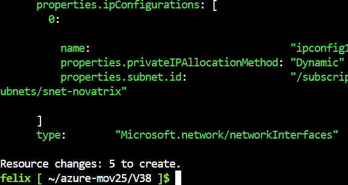
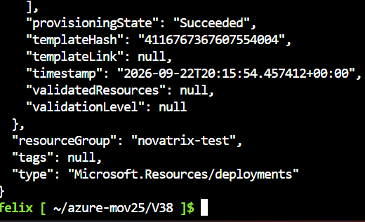
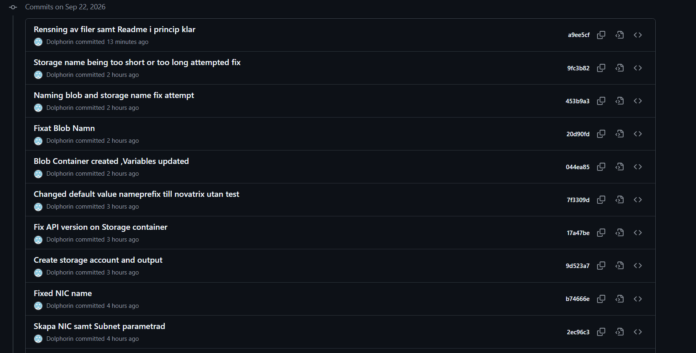

# V38 – IAC med ARM Templates

**Av Felix Samuelsson**

**Kurs: Microsoft Azure**

GitHub Repo: https://github.com/03felsam/azure-mov25

---

## Syfte

Syftet med V38 är att bygga Novatrix miljö som **Infrastructure as Code (IAC)** med hjälp av **ARM Templates**.

Istället för att skapa resurser manuellt i Azure-portalen skrivs resurserna som kod i JSON i formen av en ARM template. På detta sätt kan samma miljö återskapas igen från GitHub utan att behöva göra manuella steg i portalen.

I denna uppgift bygger jag bland annat:

- Nätverk
- Subnet
- NSG
- NIC
- Storage Account
- Blob Container

Templaten är parametriserad så att exempelvis namn och region kan ändras utan att hela templaten behöver skrivas om.

---

# Git

Jag börjar med att hämta ner mitt GitHub-repository till Azure Cloud Shell.

Först loggar jag in med GitHub:

```bash
gh auth login
```

Sedan klonar jag repositoryt:

```bash
git clone https://github.com/03felsam/azure-mov25.git
```

Går sedan in i repositoryt:

```bash
cd azure-mov25
```

Jag går sedan till mappen för V38:

```bash
cd v38
```

Här ligger JSON-filerna som används för ARM deployments. Det är från denna mappen i azure som alla kommandos kommer att köras.

---

# ARM Templates

ARM Templates används för att beskriva vilka resurser som ska skapas i Azure.

Istället för att exempelvis gå in i Azure Portal och skapa ett Storage Account manuellt beskriver jag resursen i JSON.

Azure läser sedan templaten och skapar resurserna enligt konfigurationen.

Detta gör det enklare att:

- återskapa miljön
- versionshantera ändringar
- använda samma konfiguration igen
- dokumentera infrastrukturen
- minska manuella fel

---


# Steg innan deployment

>Viktigt följande commandon samt hela ARM templaten jag har gjort är designad att skapa i en Resursgrupp. Detta behöver du göra manuellt för att kunna sedan skapa resten av miljön i den.

Men innan jag skapar resten av resurserna vill jag kontrollera att templaten är korrekt.

## Validate

Jag kan använda `validate` för att kontrollera templaten innan deployment:

```bash
az deployment group validate --resource-group novatrix-test --template-file miljoAzure-FS-.json
```

Om valideringen går igenom kan jag gå vidare.

---

## What-if

Jag kan även använda `what-if`.

Detta gör att Azure visar vilka förändringar som skulle göras utan att faktiskt skapa eller ändra resurserna.

```bash
az deployment group what-if --resource-group novatrix-test --template-file miljoAzure-FS-.json
```

Detta leder till att jag kan kontrollera templaten innan jag kör den riktiga deploymenten. Vilket gör livet mycket enklar om det går fel i mitten av deploymenten.

Detta börs alltid användas innan du deployar någonting i din azure miljö.

I följande bild kan du sett exempel på hur mycket som kommer ändras med din what if.


---

# Deployment

När templaten är kontrollerad kan jag skapa resurserna med:

```bash
az deployment group create -g novatrix-test --template-file miljoAzure-FS-.json
```

Eftersom jag använder:

```text
az deployment group
```

sker deploymenten i den Resource Group jag anger.

I detta fall:

```text
novatrix-test
```

Resource Groupen behöver därför finnas innan deploymenten körs. Detta och att skapa en VM är de enda manuella stegen i våran miljö

---

# Kod

Sakerna byggs upp ungefär i denna ordning:

```text
Resource Group
│
├── NSG
│
├── VNet
│   └── Subnet
│       └── NIC
│
└── Storage Account
    └── Blob Container
```

# Parametrar och variabler

Jag använder parametrar för sådant som jag vill kunna ändra när templaten deployas.

Exempel:

```json
"parameters": {
  "namePrefix": {
    "type": "string",
    "defaultValue": "novatrix"
  },
  "location": {
    "type": "string",
    "defaultValue": "swedencentral"
  }
}
```

Det gör att samma template kan användas igen med andra namn eller en annan Azure-region.

Jag använder sedan variabler för att bygga resursnamnen:

```json
"variables": {
  "storageName": "[concat('st', toLower(parameters('namePrefix')), uniqueString(resourceGroup().id))]",
  "vnetName": "[concat('vnet-', parameters('namePrefix'))]",
  "nsgName": "[concat('nsg-', parameters('namePrefix'))]",
  "blobName": "[toLower(concat('arenden-', parameters('namePrefix')))]",
  "NICName": "[concat('nic-', parameters('namePrefix'))]",
  "subnetName": "[concat('snet-', parameters('namePrefix'))]"
}
```

På detta sätt behöver jag inte skriva samma namn flera gånger i templaten.

---

# NSG

För nätverkssäkerheten skapar jag en Network Security Group.

Jag lägger in regler för webbtrafik på port:

```text
80  HTTP
443 HTTPS
```

Jag har även en SSH-regel på port 22.

SSH-regeln är begränsad till min publika IP-adress:

```text
83.251.180.30/32
```

`/32` betyder att endast den exakta IP-adressen tillåts.

Exempel:

```json
{
  "name": "Allow-my-SSH",
  "properties": {
    "priority": 1002,
    "protocol": "Tcp",
    "direction": "Inbound",
    "access": "Allow",
    "sourceAddressPrefix": "83.251.180.30/32",
    "sourcePortRange": "*",
    "destinationAddressPrefix": "*",
    "destinationPortRange": "22"
  }
}
```

Webbregeln använder istället:

```json
"destinationPortRanges": [
  "80",
  "443"
]
```

Det betyder att både HTTP och HTTPS tillåts.
Vid val av flera ranges skriv destinationPortRange**s** och exkludera s när det är en enstaka port. Detta problemet tog mig en stund att lösa.

---

# VNet och Subnet

Jag skapar ett Virtual Network med adressrymden:

```text
10.0.0.0/16
```

I VNet skapas sedan ett subnet:

```text
10.0.1.0/24
```

Subnetet får namnet:

```text
snet-novatrix
```

NSG kopplas till subnetet:

```json
"networkSecurityGroup": {
  "id": "[resourceId('Microsoft.Network/networkSecurityGroups', variables('nsgName'))]"
}
```

Det gör att NSG-reglerna används för trafik till resurser i subnetet.

---

# dependsOn

Jag använder `dependsOn` för att beskriva beroenden mellan resurser.

Exempelvis måste VNet finnas innan NIC kan anslutas till subnetet.

Strukturen blir:

```text
NSG
 ↓
VNet
 ↓
Subnet
 ↓
NIC
```

Exempel från VNet:

```json
"dependsOn": [
  "[resourceId('Microsoft.Network/networkSecurityGroups', variables('nsgName'))]"
]
```

NIC:en är beroende av VNet:

```json
"dependsOn": [
  "[resourceId('Microsoft.Network/virtualNetworks', variables('vnetName'))]"
]
```

Detta gör deploymenten mer tydlig och visar i vilken ordning resurserna behöver finnas.

---

# NIC

Network Interface används för att koppla VM:n till nätverket.

NIC:en kopplas till subnetet genom:

```json
"ipConfigurations": [
  {
    "name": "ipconfig1",
    "properties": {
      "subnet": {
        "id": "[resourceId('Microsoft.Network/virtualNetworks/subnets', variables('vnetName'), variables('subnetName'))]"
      },
      "privateIPAllocationMethod": "Dynamic"
    }
  }
]
```

Det betyder att NIC:en får en dynamisk privat IP-adress från subnetet.

Kopplingen blir:

```text
VNet
  ↓
snet-novatrix
  ↓
NIC
```

---

# Storage Account

Jag skapar även ett Storage Account för Novatrix. Det viktigta med detta steget är att komma ihåg att storage accounts måste vara unika och får bara vara 24 karaktärer. Detta kan uppstå problem med om man har ett längre namn än novatrix. 

Storage Account använder:

```text
Standard_LRS
```

och:

```text
StorageV2
```

Jag har även satt:

```json
"minimumTlsVersion": "TLS1_2"
```

och:

```json
"allowBlobPublicAccess": false
```

Det betyder att Blob Storage inte ska vara publikt tillgängligt.

---

# Blob Container

I Storage Account skapas även en Blob Container.

Container-namnet skapas från variabeln:

```json
"blobName": "[toLower(concat('arenden-', parameters('namePrefix')))]"
```

Container skapas med:

```json
"publicAccess": "None"
```

Det gör att containern inte har anonym publik åtkomst.

Strukturen blir:

```text
Storage Account
└── Blob Container
    └── Ärenden
```

---

# Full deployment

Den slutliga templaten deployas med:

```bash
az deployment group create -g novatrix-test --template-file miljoAzure-FS-.json
```
Om allting har gått som planerat och gått bra borde du se denna text med det viktiga är att se om **ProvisioninState: Succeeded** stämmer.


Efter deployment kontrollerar jag att deploymenten lyckades genom andra sätt även om den säger att den var en success.

Jag kan exempelvis använda:

```bash
az deployment group list --resource-group novatrix-test -o table
```

Jag kontrollerar även att resurserna finns i Resource Groupen. Genom verifiering i portalen dä jag checkar saker som att alla resurser skapades i rätt region.

---

# ARM Template

Den slutliga ARM-templaten innehåller bland annat:

- NSG
- VNet
- Subnet
- NIC
- Storage Account
- Blob Container

Template använder parametrar och variabler för att göra lösningen återanvändbar.

```json
{
  "$schema": "https://schema.management.azure.com/schemas/2019-04-01/deploymentTemplate.json#",
  "contentVersion": "1.0.3.6",
  "metadata": {
    "note": "Detta schema är för att skapa resurser utöver resursgrupper och skapar allting inuti resursgruppen."
  },
  "parameters": {
    "namePrefix": {
      "type": "string",
      "defaultValue": "novatrix",
      "metadata": {
        "description": "Prefix för alla resursnamn så att allt hänger ihop."
      }
    },
    "location": {
      "type": "string",
      "defaultValue": "swedencentral",
      "metadata": {
        "description": "Region för resurserna."
      }
    }
  }
}
```

Resten av resurserna ligger i samma ARM Template och skapas från samma deployment.

---

# Testa att återskapa miljön

För att testa att lösningen verkligen går att återskapa från repot kan jag använda en ny Resource Group.

Exempel:

```bash
az group create --name novatrix-test --location swedencentral
```

Sedan kör jag deploymenten:

```bash
az deployment group create --resource-group novatrix-test --template-file miljoAzure-FS-.json
```

På detta sätt behöver jag inte skapa resurserna manuellt igenom Azure Portal.

---
# Git

För att kunna bygga denna ARM template på ett säkert och snabbt sätt använder vi github som en centralplats för sparning av ändringar och en loggnings verktyg. 

I exemplet nedanför kan du se hur jag committar ganska regelbundet eller när man testar en ändring av koden gör man en commit. Detta hjälper utvecklingen av koden genom att identifiera vilka ändringar som orsakade att koden gick sönder.
Detta är ännu viktigare när ett flertal personer jobbar på samma projekt. 



