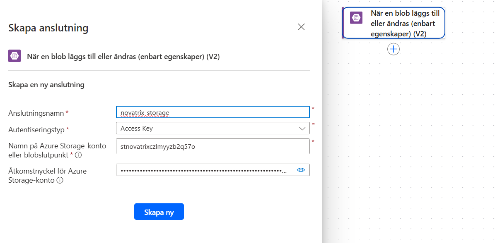

# V39 – 

**Av Felix Samuelsson**

**Kurs: Microsoft Azure**

GitHub Repo: https://github.com/03felsam/azure-mov25


##

Skapa flöden 

Utlösare:
NÄr en blob läggs till eller ändras

Authensiteringstyp Access key

````
az storage account keys list -g DIN-RESOURCEGRUPP -n DITTSTORAGEACCOUTNAME --query" [0].value" -o tsv  
````



Därefter väljer du den connectionen som skapades och browsar mappen under för att välja vilken kontainer som ska bevakas

Skapa http anrop med curl kommando 

````
curl -X POST HTTPSFÖRÄRENDET -H "Content -Type: application/json" -d'ETTJSONEXEMPEL'
````