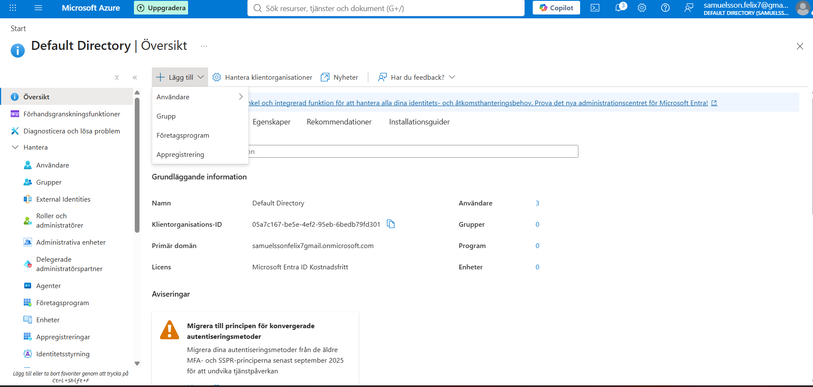
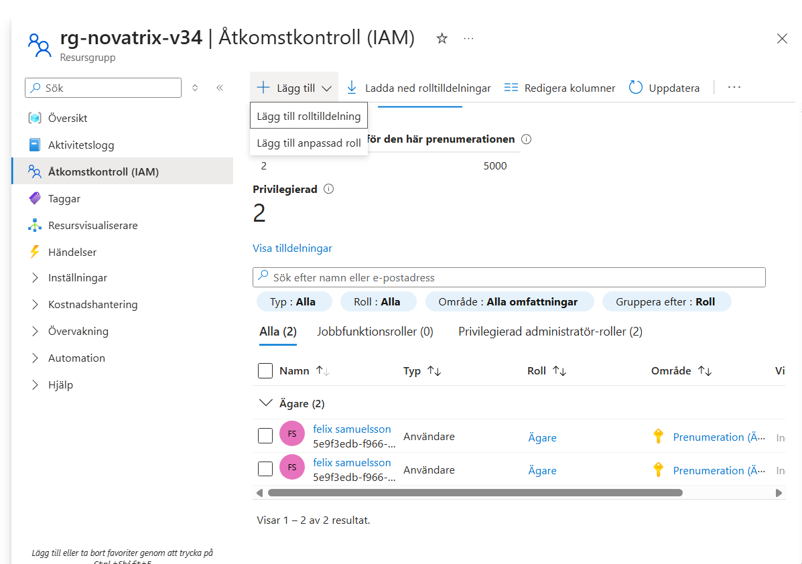
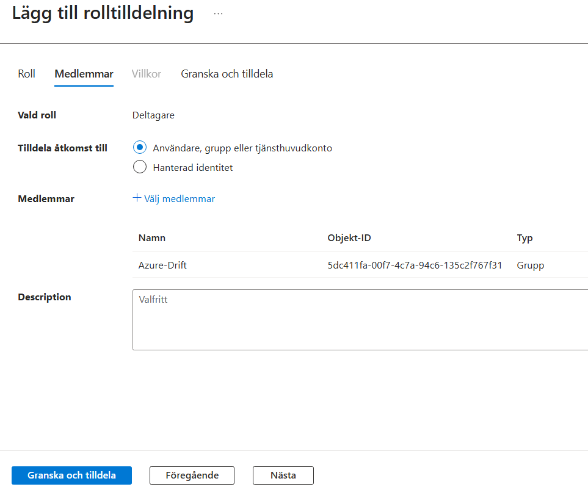
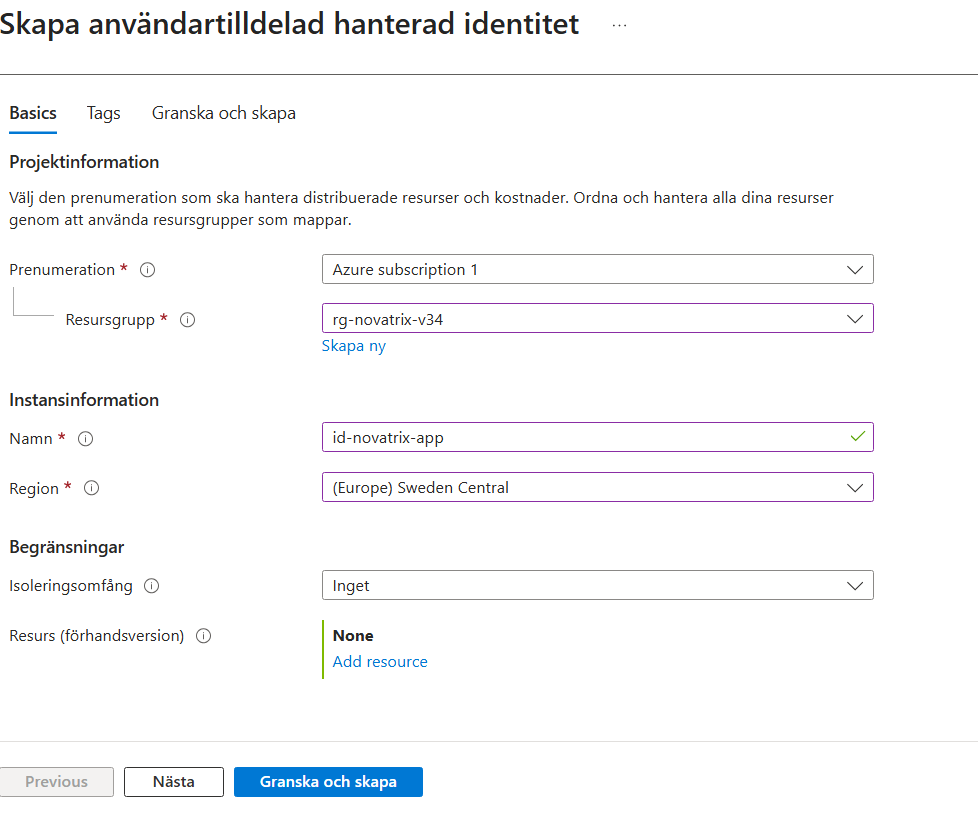
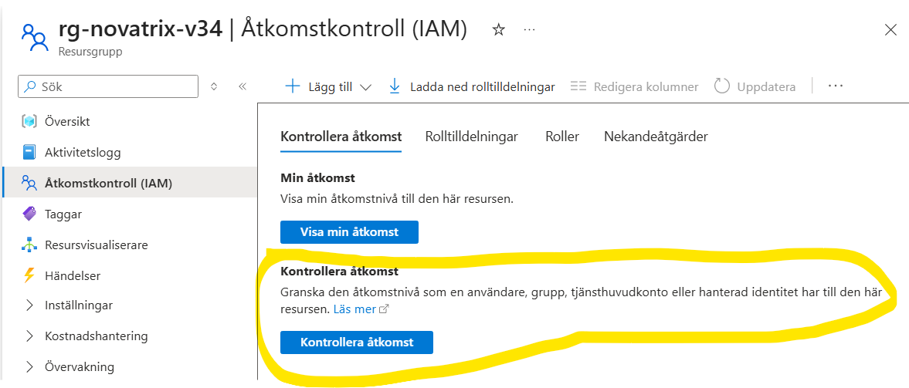
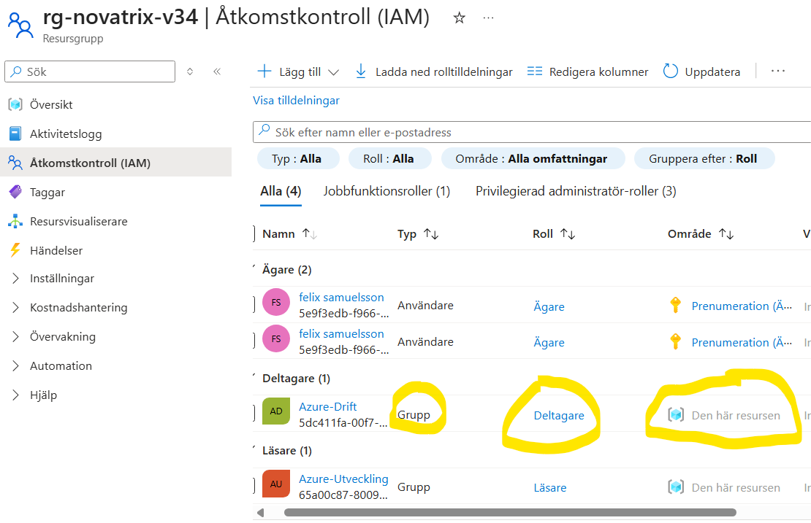
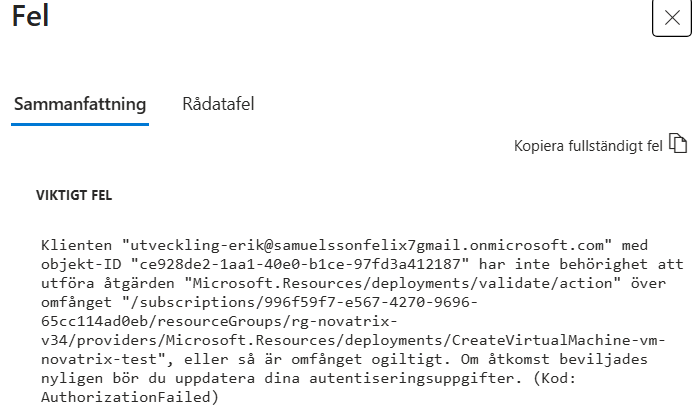

## V35- Konfiguration av access  
**Av Felix Samuelsson**  
**Kurs: Microsoft Azure**  
Github Repo: https://github.com/03felsam/azure-mov25

## Mål 
Denna uppgift handlar om säkerhet samt hanterig av administrativt arbete inom azur. Vi kommer därför gå igenom de följande områderna: 
- Skapa Användare och roller
- Tilldela Roller
- Förbered en managed identitet
- Verifiera 

## Skapa användare
För att skapa användare inom azure går vi genom 
sökvägen : Entra ID -> Directory översikt -> Användare -> skapa ny användare

Alternativt bara söka på användare

Detta är ett exempel på ett ställe du kan skapa grupper och användare från.

Själva processen att skapa användaren är ganska enkelt med det enda obligatoriska är Mailadress, visningsnamn, alias och lösenord, men det finns självklart mycket mer som kan fyllas i om man behöver.

I detta exempel kommer vi att skapa två användare en som är Erik som kommer vara en utvecklare och Anna som kommer vara drifttekniker.

Skapa grupper kan man göra från samma plats som tidigare, och med gupper kan du välja mellan Microsoft 365 eller security grupper. Security kommer att användas i detta fallet då vi kommer använda det för hantering av acceses till resurser medans 365 är mer använt för sammarbete inom 365 och saker som teams och outlook shared mailboxes. 

I detta exempel kommer vi att skapa två grupper en säkerhetsgruppp som heter Azure-drift och en säkerhets grupp som heter Azure-utveckling.

## Tilldela roller
För att hantera och säkra våran miljön behöver vi dela ut roller. Men innan det måste vi förstå vad vi gör.

 Roller är en samling av behörigheter och låser upp  åtgärder för användaren som exempel att starta en VM. 
 
 De tre vanligaste rollerna är de följande rollerna men det finns självklart otroligt många men är oftast baserade på dessa.

**Reader** : 
Får se allting ändra ingentin. Bra för insyn inom systemen.

 **Contrubutor** :
 Får skapa ändra och radera resurser. Dock får inte dela ut behörigheter.

 **Owner** :
Full kontroll inklusive att styra åtkomst. Ska nästan alldrig delas ut.

### Scopes
Scopes handlar om vad dina behörighet gäller på. Den rollen som assignas verkar bara på den scope som den är inställd på och inte utanför. De valen som finns för scopes är följande: 
**Hel prenumeration**  
**En resursgrupp**  
**En resurs**   

Med andra ord så kan en owner för en resurs inte göra någonting inom resursgruppen utan en annan roll för resursgruppen.

Det är även viktigt att vet att Scopes ärvs neråt!
Dessutom går det inte att ta bort ärvning så tilldela så litet och smått som möjligt från början. 

För våran konfiguration av miljön ska vi tilldela roller till de grupper vi har skapat. Vilket betyder att
Azure drift ska ha rollen contrubutor på rg-novatrix-v34 medans
Azure utveckling gruppen ska ha reader på rg-novatrix-v34. 

Så för att tilldela dessa roller till grupperna ska vi hitta Åtkomstkontroll (IAM) inom den resursgrupp vi ska ha access till som vi kan se ett exempel på nästa bild. Därefter trycker man på lägg till rolltilldelning och går till privligerade administratör roller där man kan välja ett flertal roller men i detta fallet ska vi ha reader eller contributor. 

Efter rollen har valts lägger man helt enkelt gruppen som en medlem i rolltilldelningen som kan ses på bilden nedanför. 

Därefter kan man spara och repetera detta för de andra gruppen.

Slutligen ska vi tilldela dina användare till gruppen de ska vara i och därefter borde vi vara klara med detta steget! 
## Förbereda en managed identity
Slutligen innan verifireing att allting fungerar kommer vi skapa en managed identity for prepp för framtiden!

 Börja med att söka efter en managed identity eller hanterad identitet och tryck på det stora korset uppe till vänster för att skapa en identitet.

 Det viktiga att tänka på för skapade identiteter är konsekvent namn plus val av resursgrupp och region. Regionnen bör vara samma som resursgruppens region annars är det inget annat obligatorisk ändring. I vårat fall såg det ut såhär!

 

 Därefter behöver vi bara skapa gruppen och den är därefter klar!

 ## Verifiering 
Det viktigaste för administrativt arbete inom RBAC är verifiering av dessa roller så att ingen typ av säkerhetsläckor händer genom att ge användare minsta möjliga access. För att göra detta kommer vi gå igenom de sätten som behövs göras.

Det enklaste sättet att kolla access för en användare är genom **Kontrollera åtkomst** knappen dä du får se exakt vilken access en användare har inom en resursgrupp.  
 
 Ett annat val av verifiering är genom att byta flik inne på åtkomstkontrollen till **Rolltilldelningar** där du kan se vilken typ av access samt vilken roll och till sist vilken scope som du kan se på den följande bilden.
 

 Den sista verifieringen vi kommer göra är helt enkelt att logga in som användaren som du har satt upp access till och försöker göra någonting som du inte borde få göra. I detta fallet loggade jag in som utvecklling-erik som bara har reader i resursgruppen rg-novatrix-v34 och försökte skapa en ny VM. Som vi ser nedanför funkar det inte men vi kan fortfarande se allting vilket betyder att det fungerade!
 
 